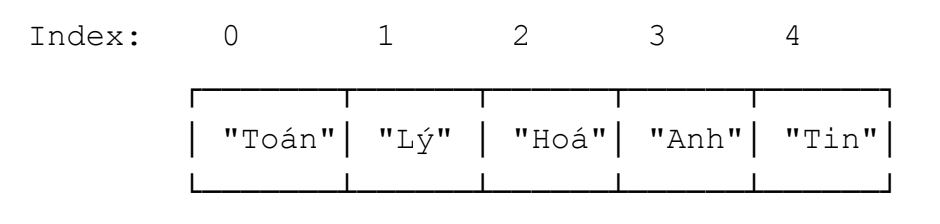

# 📚 LESSON 03 - KEY TAKE NOTE - DAY 06/03/2026 
> ghi chú những gì đã học được ở Day 3 ở đây

## ✅ GIT

### GIT - Undo Action
> Undo things

#### GIT - Undo commit message

Cách thay đổi commit message sau khi đã commit:

```git commit --amend -m```

#### GIT - Un-Stage

Cách đưa nhưng file đã add vào **Staging state** về lại **Working Directory** stag 

Cách un-stage 1 file cụ thể:

```git restore --stage <file_name>```

Cách un-stage all files:

```git restore --stage .```

#### GIT - Un-Commit

- Lệnh để reverse lại những file từ last commit từ **Repository** state về:

    - **Staging state:**

        ```git reset --soft HEAD~1```

    - **Working Directory:**

        ```git reset HEAD~1```
                    
        ***Note***: version đầy đủ sẽ có từ khoá ```--mixed``` (optional), có hay không cũng được 

**NOTE**: 
- First commit không thể reset
- Nếu muốn reset -> xoá thư mục ```.git``` đi rồi init lại từ đầu

---

### GIT - Branching

#### WHAT - Git Branching là gì?

> Bản chất của nó không phải là copy mà là 1 pointer để 1 commit

#### HOW - Git Branching hoạt động như thế nào?

- Tưởng tượng Project như 1 dòng thời gian

- Branch cho phép tạo ra nhiều dòng thời gian song song cho phép:
        - **Phát triển các phần mới** mà không **ảnh hưởng** tới **phần code đang ổn định**
        - Nhiều người có làm việc **độc lập** cùng lúc trên 1 Project mà không ảnh hưởng tới nhau
        - Nếu hỏng có thể **delete 1 branch** đi mà **không gây ảnh hưởng gì**

#### Các câu lệnh khi làm việc với Branch

- **Tạo branch mới** -> ```git branch <branch_name>```

- **Checkout branch đã tạo** -> ```git checkout <branch_name>```

- **Xem list tất cả các Branch đang có** -> ```git branch```

- **Xoá branch** -> ```git branch -D <branch_name>```

- **Đưa branch lên online** -> ```git push origin <branch_name>```

- **Xoá branch trên online** -> ```git push -D origin <branch_name>```

### GIT - Ignore File

#### WHAT - File .gitignore là gì?

> ```.gitignore``` là 1 file cấu hình quan trọng, dùng để đánh dấu cho Git biết **những file và thư mục sẽ untracked (không được theo dõi)** bởi Git

#### WHY - Tại sao cần .gitignore?

Trong dự án thực thế sẽ có nhiều file không cần add lên Repository:

- File tạm thời của hệ điều hành (.DS_Store, Thumbs.db)  
- Thư mục dependencies (node_modules/, vendor/) 
- File build và artifacts (dist/, build/, *.exe)
- File cấu hình cá nhân (IDE settings, environment variables)
- File nhạy cảm (API keys, passwords, certificates)
- File log và database local

#### HOW - Cú pháp cho file .gitignore

**Comment** - dòng đầu tiên bắt đầu bằng # là ghi chú:

- \# Ignore 1 file cụ thể -> ```<file_name>```

- \# Ignore tất cả các file có extension là .log -> ```.log```

- \# Ignore thư mục -> ```<tên thư mục>/```

- \# Ignore file trong mọi thư mục con -> ```**/*.tmp```

- \# Ngoại lệ - KHÔNG ignore file này (dùng !) -> ```!important.log```

- \# Ignore file chỉ ở thư mục gốc -> ```/TODO```

- \# Ignore tất cả file .txt trong thư mục ->

```
doc/
doc/**/*.txt
```

## ✅ JavaScript Basic

### Câu Điều Kiện

> Câu điều kiện dùng để kiểm tra 1 đoạn logic trước khi chạy
- Nếu điều kiện **đúng** mới chạy, **sai** thì dừng

Có 4 loại câu điều kiện:
- if
- if ... else
- if .. else ... if ... else
- switch ... case

#### IF Statement (buổi này học if trước)

Cú pháp:

```
if (<condition>) {
    //code...
} 
```


```
<condition> = true -> thực hiện đoạn code bên trong
<conditon> = false -> dừng và thoát 
```
### Vòng lặp (loop)

> Dùng để lặp lại 1 đoạn logic, có thể lặp số lần nhất định, tuỳ theo điều kiện dừng hoặc lặp vô hạn

Trong JS có 6 loại loops:
- for (i)
- for (of)
- for (each)
- for (in)
- while
- do...while

#### FOR (i) loop (buổi này học for (i) loop trước)

Cú pháp:

```
for (<khởi tạo> ; <điều kiện lặp> : <cập nhật>) {
    //code ...
}
```

- **Khởi tạo:** chạy 1 lần duy nhất khi vòng lặp bắt đầu chạy
- **Điều kiện lặp:** nếu đúng thì chạy tiếp, nếu sai thì dừng vòng lặp lại
- **Cập nhật:** chạy vào mỗi cuối vòng lặp, thay đổi giá trị của biến đếm i

**Example**
- Lặp tiến:
```
for (let i = 0 ; i < 10 ; i++){
    console.log(i);
}
```
- Lặp lùi
```
for (let i = 10 ; i > 1 ; i--){
    console.log(i)
}
```
### Convention

**WHY - Tại sao cần Convention?**
- Code follow theo format chung
- Giúp code dễ đọc, dễ hiểu

**Một số Convention phổ biến:**
- snake_case
- kebab - case
- camelCase
- PascalCase

**Dùng trong lớp học:**
- snake_case -> tạm thời chưa dùng
- kebab - case -> đặt tên file, folder
- camelCase -> tên variable, function
- PascalCase -> tên class

### ADD ON - Console.log Nâng Cao

- Sử dụng với nháy đơn, nháy kép
``` 
console.log('hello')
console.log("hello")
```

- Sử dụng kèm với variable
```
let name = "Han"
console.log(`My name is ${name}`)
```

- Sử dụng cộng chuỗi
```
let name = "Han"
console.log("My name" + name)
```

# 📚 LESSON 04 - KEY TAKE NOTE - DAY 09/03/2026

## JavaScript Basic - Continue of Day 3

### ✅ OBJECT

#### WHAT - Object là gì?

> Là kiểu dữ liệu được lưu trữ dưới dạng cặp ```key: value```

#### WHY - Tại sao cần phải dùng Object?

Tạo hồ sơ lưu trữ thông tin của 1 học sinh

- Khi không dùng Object:

```
let name = "Ngoc Han";
let age = 18;
let className = "Playwright K22";
```

=> 3 biến rời rạc khó quản lý

- Khi dùng Object:
```
let student = {
    name: "Ngoc Han";
    age: 18;
    className: "Playwright K22";
}
```
=> Gom gọn tất cả các thông tin vào **1 biến duy nhất**, **ưu điểm dễ quản lý**, **dễ truy xuất** và **dễ truyền đi khi cần dùng**

> **⭐️ Key Note:** **Object** có thể tưởng tượng như 1 record, bên trong có nhiều mục khác nhau được lưu trữ dưới dạng từng cặp **key** và **value**
---

#### HOW - Cách Khai Báo Object?

> Có 2 cách để khai báo Object:

**Cách 1: Object Literal (phổ biến nhất)** => được sử dụng nhiều nhất trong thực tế
```
let student = {
    name: "Ngoc Han",
    age: 18,
    className: "Playwright K22"
}
```

**Cách 2: Dùng new Object()**
```
let student = new Object();
student.name = "Ngoc Han"; 
student.age = 18;
student.className = "Playwright K22";
```

##### Convention - Quy tắc đặt tên Key

- Key thường có kiểu dữ liệu là **String**

- Nếu tên key **không có ký tự đặc biệt, khoảng trắng** -> không cần phải đặt trong cặp nháy kép
    - Ví dụ: 
    ```
    name: "Ngoc Han";
    ```
- Nếu tên key **có ký tự đặc biệt, khoảng trắng** -> bắt buộc phải đặt trong cặp nháy kép 
    - - Ví dụ: 
    ```
    "full name": "Ngoc Han";
    ```

#### HOW - Cách Truy Xuất Dữ Liệu Trong Object

**Cách 1: Dot notation (dấu chấm) - Phổ biến**
```
let student = {
    name: "Ngoc Han",
    age: 18,
    className: "Playwright K22",
}
```
Lấy ra value của name, age
```
console.log(student.name); => "Ngoc Han"
console.log(student.age); => 18
```

**Cách 2: Bracket notation (Dấu ngoặc vuông)**
```
let student = {
    "full name": "Ngoc Han",
    age: 18,
    "class name": "Playwright K22"
}
```
Lấy ra value của full name, class name
```
console.log(student["full name"]); => "Ngoc Han"
console.log(student["class name"]); => 18
```

Khi nào thì **bắt buộc** phải dùng Bracket Notation
- Key có dấu cách hoặc ký tự đặc biệt
- Key là biến

Ví dụ:
```
const user = {
  "user name": "Nguyen Van A", // Có khoảng trắng
  100: "Điểm tối đa"          // Bắt đầu bằng số
};

// Dùng biến (động)
const key = "user name";
console.log(user[key]); 
```

#### HOW - Gán giá trị cho Object
```
let student = {
    "full name": "Ngoc Han",
    age: 18,
    "class name": "Playwright K22"
}

//Update giá trị => key đã có
student.age = 20;
student["full name"] = "Ngoc Han 123";

//Add thêm key mới => key chưa tồn tại, auto tạo mới
student.email = "Han@gmail.com";
student["middle name"] = "Phung";
```

#### HOW - Thêm, Sửa, Xoá Thuộc Tính
```
let student = {
    "full name": "Ngoc Han",
    age: 18,
    "class name": "Playwright K22"
}
```
**Thêm**
```
student.email = "Han@gmail.com"; // thêm bằng dot
student["middle name"] = "Phung"; // thêm bằng bracket
```
**Sửa**
```
student.age = 20;
```
**Xoá** -> delete chỉ xoá property ra khỏi Object chứ không xoá biến
```
delete student.email; // xoá bằng dot
delete student["class name"]; // xoá bằng bracket
```

#### Object Lồng Nhau (Nested Object)

Value của 1 Key có thể là bất kì 1 loại dữ liệu nào, kể cả là 1 **Object khác**

```
let sinhVien = {
    hoTen: "Minh",
    tuoi: 21,
    diaChi: {
        soNha: "12",
        duong: "Lê Lợi",
        thanhPho: "Hồ Chí Minh"
    }
};
```
Cách truy xuất Object lồng nhau:
```
console.log(sinhVien.diaChi.soNha);
console.log(sinhVien["diaChi"]["soNha"])
```
---
**Summary**
|Action|Syntax|Example|
|---|---|---|
|Khai báo|```{}``` hoặc ```new Object()```|```let obj = {a: 1}``` hoặc ```let obj = new Object()```|
|Truy xuất|.key hoặc ["key"]|```obj.a``` hoặc ```obj["a"]```|
|Thêm/Sửa|```obj.key = value```|```obj.a = 2```|
|Lồng nhau|value là **Object**|```obj.x.y.z```|

### ✅ ARRAY

#### WHAT - Array là gì?

> Là kiểu dữ liệu dùng để lưu trữ **1 danh sách có thứ tự**

#### WHY - Tại sao lại cần dùng Array?

- Nếu **không dùng** Array:

Ví dụ:
```
let mon1 = "Toán";
let mon2 = "Lý";
let mon3 = "Hoá";
let mon4 = "Anh";
let mon5 = "Tin";
```
-> 5 biến rời rạc. Nếu có nhiều môn hơn thì không quản lý được

- Nếu **dùng** Array:

Ví dụ:
```
let monHoc = ["Toán", "Lý", "Hoá", "Anh", "Tin"];
```
-> 1 biến duy nhất chứa toàn bộ danh sách, dễ quản lý, dễ duyệt qua

> Array giống như là 1 danh sách được đánh số - mỗi phần tử đều có index tương ứng, bắt đầu từ 0



#### HOW - Cách khai báo Array

**Cách 1: Array Literal**
```
let monHoc = ["Toán", "Lý", "Hoá", "Anh", "Tin"];
```

**Cách 2: Dùng new Array()**
```
let monHoc = new Array("Toán", "Lý", "Hoá", "Anh", "Tin");
```

**Note**:
- Array có thể chứa nhiều kiểu dữ liệu khác nhau
- Tuy nhiên trong thực tế trong 1 danh sách nên giữ các phần tử cùng kiểu để dễ xử lý

#### HOW - Truy xuất dữ liệu trong Array

- Lấy phần tử theo index
```
let monHoc = ["Toán", "Lý", "Hoá", "Anh", "Tin"];
//lấy phần từ cuối cùng
monHoc[4];
//lấy phần tử đầu tiên
monHoc[0];
//lấy phần từ không tồn tại
monHoc[5] => undefined
```
- Đếm số phần từ -> dùng ```length```
```
monHoc.length => output: 5
```
- Gán lại giá trị theo index
```
monHoc[1] = "Vật lý";
```

#### HOW - Thêm, Xoá phần tử

- Thêm vào cuối -> ```.push()```
- Xoá phần tử cuối -> ```.pop()```
- Thêm vào đầu -> ```.unshift()```
- Xoá phần tử đầu -> ```.shift()```

#### Kết hợp Array với For loop
> Giúp xử lý hàng loạt dữ liệu

Ví dụ:
```
//Tính tổng các số trong array
const arr = [8, 9, 7, 10, 14];

let sum = 0;
for (let i = 0; i < arr.length; i++){
    sum += arr[i];
}

console.log(sum)
```

### ✅ FUNCTION

#### WHAT - Function là gì?
> Là 1 khối lệnh được đặt tên, có thể gọi lại nhiều lần mà không cần viết lại code

#### WHY - Tại sao cần dùng Function?
> Những thao tác, code cần dùng đi dùng lại ở nhiều chỗ khác nhau trong chương trình -> nếu cần sửa thì sẽ phải sửa 1 lúc nhiều chỗ. **Dễ sót, dễ sai**.

**Function có thể giải quyết vấn đề** 
- Khai báo 1 lần, dùng nhiều lần
- Khi cần chỉ cần sửa 1 chỗ duy nhất

Tưởng tượng function giống như công thức nấu ăn, khi đã có công thức thì áp dụng vào nấu bao nhiêu lần cũng được

#### HOW - Cách khai báo Function

```
function tenHam() {
    //code ...
}
```

- **function**: từ khoá bắt buộc
- **tenHam**: tên hàm cho mình tự đặt
- **{}**: body của hàm, bên trong chứa code sẽ thực thi

#### HOW - Quy tắc đặt tên Function

- Dùng **camelCase** 
- Nên bắt đầu bằng **Động từ**
- Tên phải **diễn tả được hành động** mà fucntion thực hiện bên trong

> **Lưu ý:* Hàm chỉ chạy khi bạn gọi nó
```
Gọi hàm = tên hàm + dấu ()
```

#### WHAT - Function with Parameter

**Parameter** là tham số truyền vào khi gọi hàm 

##### Phân biệt Parameter(tham số) và Agrument(đối số)

```
// Parameter(tham số) -> biến giữ chỗ khi khai báo function 
    function chao(ten){
        console.log("Xin chào" + ten + "!");
    }

// Agrument(đối số) -> giá trị thật khi call function
    chao("Lan"); -> "Lan" chính là đối số
```
**Một function có thể có nhiều Parameter**

- Khi truyền các đối số vào cần truyền theo thứ tự parameter tương ứng đã khai báo ở function trước đó
- Nếu không truyền vào đối số thì output của tham số ra sẽ là ```undefined```

#### WHAT - Fucntion có giá trị trả về: RETURN

> Ngoài làm gì đó, function còn có thể return kết quả để dùng tiếp 

- **Không có return** -> chỉ ___làm___
- **Có return** -> làm xong ___"trả kết quả"___

> **Note:** ```return``` sẽ dừng hàm ngay lập tức
