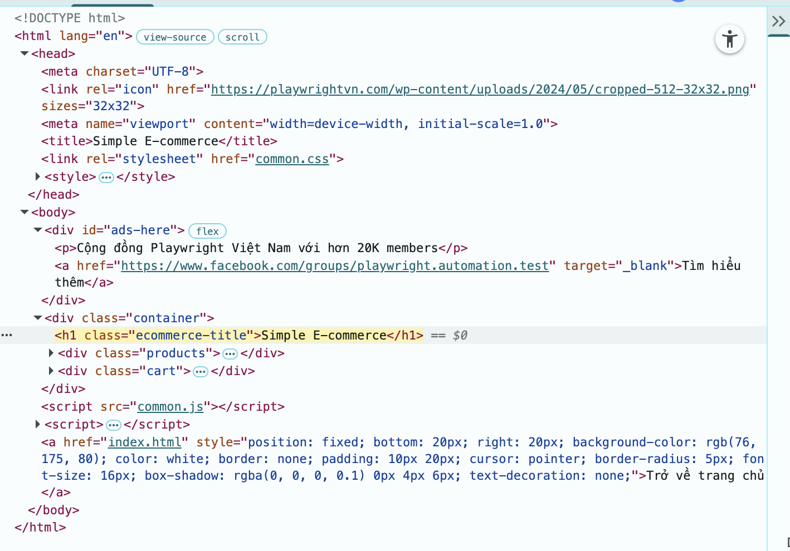

# 📚 LESSON 05 - KEY TAKE NOTE - DAY 16/03/2026 
> ghi chú những gì đã học được ở Day 5 ở đây

## ✅ DOM

### WHAT - DOM (Document Object Model) là gì? 

Khi vào website -> ta sẽ nhìn thấy web dưới dạng tree có cấu trúc
=> View tree bằng cách bấm phím F12, hoặc chọn Inspect (Dev Tools) -> chọn tab **Element**

Ví dụ:
```
<h1>Tài liệu học Automation Test</h1> //<thẻ mở> ... </thẻ đóng>

 //thẻ tự đóng
<br/> //tượng trưng cho xuống dòng
<hr/> //tượng trưng cho dấu gạch
```

**Cấu trúc của 1 Element**
```
<Tag mở | Thuộc tính="Giá trị của thuộc tính"> | Text | </Tag đóng>
                                    
------------------------------------------  

<option value="usa">United State</option>
```

- Một element có thể có nhiều thuộc tính
- Có thể có thuộc tính không có giá trị gì chỉ tồn tại thôi
- Một thẻ có thể bao gồm thẻ khác

> Một website thực ra là 1 tập hợp cấu tạo các thẻ

### DOM - Các thẻ HTML thường gặp

Có nhiều loại thẻ khác nhau:
- Thẻ tiêu chuẩn: 
    - Thẻ do tổ chức uy tín Mozilla định nghĩa
- Thẻ tự định nghĩa:
    - do lập trình viên/website tự định nghĩa

Các thẻ tiêu chuẩn thường gặp 

**Thẻ cấu trúc khung trang**
- ```<html>```: Thẻ gốc của trang
- ```<head>```: Chứa metadata: tiêu đề của web, hiển thị GG
- ```<body>```: Nội dung của cả website hiển thị

**Thẻ bố cục và ngữ nghĩa**
- ```<div>```: Khối container chung (viết tắt của divide)
- ```<header> , <footer>, <nav>, <section>```: Thẻ ngữ nghĩa

**Thẻ nội dung**
- ```<h1> -> <h6>```: Tiêu đề
- ```<p>```: Đoạn văn
- ```<ul>, <ol>, <li>```: Danh sách
    - ```<ul>``` -> Danh sách không có thứ tự
    - ```<ol>``` -> Danh sách có thứ tự
    - ```<li>``` -> list item
```
<ol>
    <li> Cơm rang </li>
    <li> Cá chiên </li>
    <li> Canh Cua </li>
</ol>
```

**Thẻ tương tác & Media**
- ```<a>```: Liên hết
```
<a href="https://www.google.com/">Click Vào Đây, Tới GG nè</a>
```
- ``````: Hình ảnh
```
 
```

**Thẻ Form (Quan trọng cho testing)**
- ```<form>```: Biểu mẫu
- ```<input>```: Ô nhập liệu (text, password, checkbox, radio, ...)
- ```<select>``` và <option>```: Dropdown
- ```<textarea>```: Vùng văn bản nhiều dòng

**Note**
Link demo: https://material.playwrightvn.com/035-DOM-elements.html

## ✅ SELECTOR

### WHAT - Selector là gì?
Là cách mà chúng ta chọn được các phần tử trên trang web
Để tương tác được với các phần tử mà ta cần thì phải tìm được nó

**Có 3 loại Selector thường dùng:**
- XPath
- CSS Selector
- Playwright Selector

### SELECTOR - XPath (hôm nay học phần này trước)

- Dùng được hầu hết trong tất cả các trường hợp
- Đa dạng, có khả năng tìm các phần tử nhỏ
- Hơi dài

**XPath Selector**
> XPath = XMP Path

- Có 2 loại:
    - **Tuyệt đối:** đi dọc theo cây DOM
        - Bắt đầu bởi ```/```
    - **Tương đối:** tìm dựa vào đặc tính
        - Bắt đầu bởi ```//```
        -  ```//<tên thẻ> [@thuộc tính=giá trị]```
        - Luôn kết hợp các attribute như @id, @class, @name để XPath chính xác hơn
            - ```//tên thẻ[@thuộc tính=giá trị and @thuộc tính=giá trị and ...]```
- Nên dùng **Xpath tương đối**

**Nuyên lý:** 
- Đi dọc theo cây DOM, tìm phần từ cần tìm

**XPath tuyệt đối - Ví dụ:**
```
<html>
    <head> </head>
    <body>
        <h1> Chào mừng tới với lớp</h1> -> xpath: /html/body/h1

        <div>
            <ul>
                <li>Bài 1</li> -> xpath: /html/body/div/ul
                <li>Bài 2</li>
                <li>Bài 3</li>
            </ul>
        </div>
    </body>
</html>
```

**XPath tương đối - Ví dụ:**

```
//h1[@class='ecommerce-title']
```


### SELECTOR - CSS Selector

- Ngắn gọn, performance cao
- Dùng cho các trường hợp dễ tìm
- Không linh hoạt bằng XPath

### SELECTOR - Playwright Selector

- Chỉ dùng riêng cho Playwright 
- Cú pháp ngắn gọn, không phụ thuộc vào cấu trúc cây DOM
- Hướng tới "giống người dùng đang nhìn thấy gì"

## ✅ PLAYWRIGHT BASIC SYNTAX

Automation = Action + Assertion

Cách tương tác với các phần tử
- Viết 1 test
- Tổ chức thành các step
- Tương tác cơ bản
    - Navigation
    - Click
    - Fill


- **test** -> Đơn vị cơ bản dể khai báo 1 test
- **step** -> Đơn vị nhỏ hơn test để khai báo từng step của tcs
    - Lưu ý: step nên được map 1-1 với tcs để dễ dàng maintain

```
test("<tên test>", async ({ page })) => (
    //code test
));

------------------------

test("<tên test>", async ({ page })) => (
    //code test
    await test.step("<tên step>", async () => {
        //step 
    });
));
```

- **navigate** -> ```page.goto("<link>")```
- **locate** -> ```page.locator("<selector>")```
- **click** -> ```page.locator("<selector>").click()```